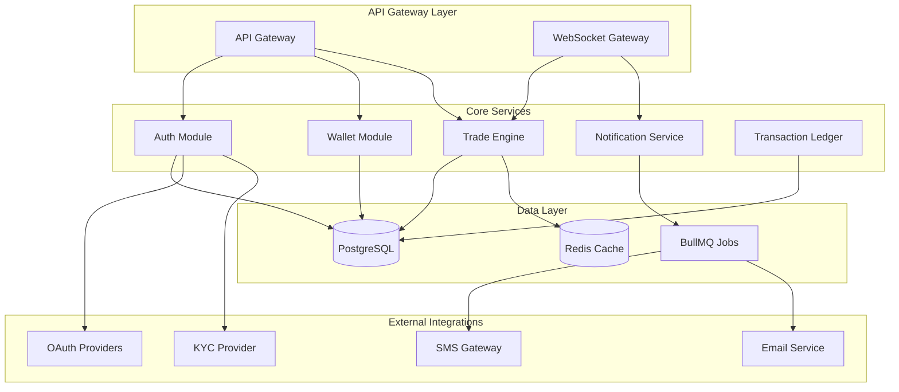

# B2Broker Crypto Platform

# 🚀 Cryptocurrency Exchange Backend

A high-performance, secure cryptocurrency trading platform built with **NestJS (v10+)**, **TypeScript**, and **PostgreSQL** using microservice-friendly modular architecture. This backend system powers a production-ready crypto exchange with real-time trading capabilities, robust user authentication, and enterprise-grade security.

## ✨ Core Features

- **Spot Trading Engine** - High-frequency order matching with sub-millisecond latency
- **User Authentication** - OAuth2 integration with 2FA support and JWT token management
- **Transaction Ledger** - ACID-compliant wallet service with audit trails
- **Rate-Limited APIs** - REST and WebSocket endpoints with intelligent throttling
- **Real-time Notifications** - Multi-channel delivery (email, SMS, in-app)

## 🏗️ Architecture & Design Patterns

### High-Level System Architecture



### Design Patterns & Architecture Principles

#### 🏛️ Modular Monolith

Our system follows a **modular monolith** approach, providing clear separation of concerns while maintaining the simplicity of a single deployment unit. Each module encapsulates its domain logic, data access, and business rules:

```typescript
// Example: Wallet Module Structure
src/modules/wallet/
├── controllers/
│   ├── wallet.controller.ts
│   └── transaction.controller.ts
├── services/
│   ├── wallet.service.ts
│   ├── transaction.service.ts
│   └── fee-calculator.service.ts
├── entities/
│   ├── wallet.entity.ts
│   └── transaction.entity.ts
├── repositories/
│   └── wallet.repository.ts
├── dto/
│   ├── create-wallet.dto.ts
│   └── transfer-funds.dto.ts
└── wallet.module.ts
```

#### 🔄 CQRS + Event-Driven Architecture

We implement **Command Query Responsibility Segregation (CQRS)** for the trading flow, separating read and write operations for optimal performance:

```typescript
// Command Handler Example
@CommandHandler(CreateOrderCommand)
export class CreateOrderHandler implements ICommandHandler<CreateOrderCommand> {
  constructor(
    private readonly orderRepository: OrderRepository,
    private readonly eventBus: EventBus
  ) {}

  async execute(command: CreateOrderCommand): Promise<Order> {
    const order = await this.orderRepository.create(command);

    // Publish domain event
    this.eventBus.publish(new OrderCreatedEvent(order));

    return order;
  }
}

// Event Handler Example
@EventsHandler(OrderCreatedEvent)
export class OrderCreatedHandler implements IEventHandler<OrderCreatedEvent> {
  constructor(private readonly matchingEngine: MatchingEngineService) {}

  async handle(event: OrderCreatedEvent): Promise<void> {
    await this.matchingEngine.processOrder(event.order);
  }
}
```

#### 🗄️ Repository Pattern with TypeORM Abstraction

Custom repository abstraction over TypeORM provides type-safe data access with advanced querying capabilities:

```typescript
// Custom Repository Implementation
@Injectable()
export class WalletRepository extends BaseRepository<Wallet> {
  async findByUserIdWithLock(userId: string): Promise<Wallet> {
    return this.createQueryBuilder("wallet")
      .setLock("pessimistic_write")
      .where("wallet.userId = :userId", { userId })
      .getOne();
  }

  async updateBalanceWithOptimisticLock(
    walletId: string,
    amount: Decimal,
    version: number
  ): Promise<UpdateResult> {
    return this.createQueryBuilder()
      .update(Wallet)
      .set({
        balance: () => `balance + ${amount}`,
        version: version + 1,
      })
      .where("id = :walletId AND version = :version", { walletId, version })
      .execute();
  }
}
```

#### 🏭 Factory & Strategy Pattern for Dynamic Fee Calculation

Dynamic fee calculation using factory and strategy patterns for different user tiers and trading pairs:

```typescript
// Fee Strategy Interface
interface FeeStrategy {
  calculateFee(amount: Decimal, userTier: UserTier): Decimal;
}

// Concrete Strategies
@Injectable()
class MakerFeeStrategy implements FeeStrategy {
  calculateFee(amount: Decimal, userTier: UserTier): Decimal {
    const baseRate = this.getBaseRate(userTier);
    return amount.mul(baseRate.maker);
  }
}

@Injectable()
class TakerFeeStrategy implements FeeStrategy {
  calculateFee(amount: Decimal, userTier: UserTier): Decimal {
    const baseRate = this.getBaseRate(userTier);
    return amount.mul(baseRate.taker);
  }
}

// Fee Calculator Factory
@Injectable()
export class FeeCalculatorFactory {
  constructor(
    private readonly makerStrategy: MakerFeeStrategy,
    private readonly takerStrategy: TakerFeeStrategy
  ) {}

  createStrategy(orderType: OrderType): FeeStrategy {
    switch (orderType) {
      case OrderType.MAKER:
        return this.makerStrategy;
      case OrderType.TAKER:
        return this.takerStrategy;
      default:
        throw new Error(`Unsupported order type: ${orderType}`);
    }
  }
}
```

#### 🔧 Configuration & External API Integration

Leveraging `nestjs-config` and `nestjs-axios` for robust configuration management and external API integrations:

```typescript
// Configuration Management
@Module({
  imports: [
    ConfigModule.forRoot({
      isGlobal: true,
      validationSchema: Joi.object({
        DATABASE_URL: Joi.string().required(),
        REDIS_URL: Joi.string().required(),
        JWT_SECRET: Joi.string().min(32).required(),
        API_RATE_LIMIT: Joi.number().default(1000),
      }),
    }),
  ],
})
export class AppModule {}

// External API Integration
@Injectable()
export class KYCService {
  constructor(
    private readonly httpService: HttpService,
    @Inject("KYC_CONFIG") private readonly config: KYCConfig
  ) {}

  async verifyUser(kycData: KYCData): Promise<VerificationResult> {
    const response = await this.httpService
      .post(`${this.config.baseUrl}/verify`, kycData, {
        headers: { Authorization: `Bearer ${this.config.apiKey}` },
        timeout: 10000,
      })
      .toPromise();

    return response.data;
  }
}
```

## 🧠 Technical Challenges & Solutions

### 1. Ensuring Consistency Across Wallet Transactions Under High Concurrency

**Challenge**: Multiple concurrent transactions could lead to race conditions and inconsistent wallet balances.

**Solution**: Implemented PostgreSQL advisory locks and serialized transaction isolation:

```typescript
@Injectable()
export class WalletService {
  constructor(
    private readonly walletRepository: WalletRepository,
    private readonly dataSource: DataSource
  ) {}

  async transferFunds(
    fromWalletId: string,
    toWalletId: string,
    amount: Decimal
  ): Promise<TransferResult> {
    return this.dataSource.transaction("SERIALIZABLE", async (manager) => {
      // Acquire advisory locks to prevent deadlocks
      await manager.query("SELECT pg_advisory_xact_lock($1, $2)", [
        this.getLockKey(fromWalletId),
        this.getLockKey(toWalletId),
      ]);

      const fromWallet = await this.walletRepository.findByUserIdWithLock(
        fromWalletId
      );

      if (fromWallet.balance.lt(amount)) {
        throw new InsufficientFundsError();
      }

      // Atomic balance updates
      await this.walletRepository.updateBalance(fromWalletId, amount.neg());
      await this.walletRepository.updateBalance(toWalletId, amount);

      return { success: true };
    });
  }
}
```

### 2. Optimizing Order Matching Latency

**Challenge**: Traditional database-based order matching couldn't meet sub-millisecond latency requirements.

**Solution**: Implemented in-memory order book with fallback persistence and Redis-based pub/sub sync:

```typescript
@Injectable()
export class MatchingEngineService {
  private orderBooks = new Map<string, OrderBook>();

  constructor(
    private readonly redisService: RedisService,
    private readonly orderRepository: OrderRepository
  ) {
    this.initializeOrderBooks();
  }

  async processOrder(order: Order): Promise<MatchResult[]> {
    const orderBook = this.orderBooks.get(order.symbol);
    const matches = orderBook.match(order);

    if (matches.length > 0) {
      // Persist matches asynchronously
      this.persistMatches(matches);

      // Sync across instances via Redis
      await this.redisService.publish("order_matched", {
        symbol: order.symbol,
        matches: matches.map((m) => m.id),
      });
    }

    return matches;
  }

  private async persistMatches(matches: MatchResult[]): Promise<void> {
    // Batch insert for performance
    await this.orderRepository.batchInsertMatches(matches);
  }
}
```

### 3. Scalable User Notification System Across Email, SMS, and In-App

**Challenge**: Supporting multiple notification channels with different delivery requirements and failure handling.

**Solution**: Designed with a pluggable strategy pattern + job queues via BullMQ:

```typescript
// Notification Strategy Interface
interface NotificationStrategy {
  send(notification: Notification): Promise<SendResult>;
  getRetryConfig(): RetryConfig;
}

// Email Strategy
@Injectable()
export class EmailNotificationStrategy implements NotificationStrategy {
  async send(notification: Notification): Promise<SendResult> {
    // Email sending logic
    return { success: true, channel: "email" };
  }

  getRetryConfig(): RetryConfig {
    return { attempts: 3, backoff: "exponential" };
  }
}

// Notification Service with Queue
@Injectable()
export class NotificationService {
  constructor(
    @InjectQueue("notifications") private readonly queue: Queue,
    private readonly strategyFactory: NotificationStrategyFactory
  ) {}

  async sendNotification(notification: Notification): Promise<void> {
    const strategy = this.strategyFactory.createStrategy(notification.channel);

    await this.queue.add(
      "send-notification",
      {
        notification,
        strategy: notification.channel,
      },
      {
        attempts: strategy.getRetryConfig().attempts,
        backoff: strategy.getRetryConfig().backoff,
      }
    );
  }
}

// Queue Processor
@Processor("notifications")
export class NotificationProcessor {
  constructor(private readonly strategyFactory: NotificationStrategyFactory) {}

  @Process("send-notification")
  async processNotification(job: Job<NotificationJob>): Promise<void> {
    const strategy = this.strategyFactory.createStrategy(job.data.strategy);
    await strategy.send(job.data.notification);
  }
}
```

## 🎨 Design System Philosophy

### Logging Structure & Observability

Standardized logging with structured data, error codes, and trace IDs for comprehensive observability:

```typescript
// Custom Logger Service
@Injectable()
export class LoggerService {
  private logger = new Logger("CryptoExchange");

  logTrade(trade: Trade, context: string): void {
    this.logger.log(
      {
        event: "TRADE_EXECUTED",
        tradeId: trade.id,
        symbol: trade.symbol,
        amount: trade.amount.toString(),
        price: trade.price.toString(),
        timestamp: trade.timestamp,
        traceId: this.getTraceId(),
      },
      context
    );
  }

  logError(error: Error, context: string, metadata?: any): void {
    this.logger.error(
      {
        event: "ERROR_OCCURRED",
        errorCode: this.getErrorCode(error),
        message: error.message,
        stack: error.stack,
        metadata,
        traceId: this.getTraceId(),
      },
      context
    );
  }
}
```

### API Response Format & Versioning

Consistent API response structure with versioning and standardized error handling:

```typescript
// Response DTOs
export class ApiResponse<T> {
  @ApiProperty()
  success: boolean;

  @ApiProperty()
  data?: T;

  @ApiProperty()
  error?: ApiError;

  @ApiProperty()
  timestamp: string;

  @ApiProperty()
  version: string;

  constructor(data?: T, error?: ApiError) {
    this.success = !error;
    this.data = data;
    this.error = error;
    this.timestamp = new Date().toISOString();
    this.version = "v1";
  }
}

// Global Exception Filter
@Catch()
export class GlobalExceptionFilter implements ExceptionFilter {
  catch(exception: unknown, host: ArgumentsHost): void {
    const ctx = host.switchToHttp();
    const response = ctx.getResponse<Response>();

    const apiError = this.mapExceptionToApiError(exception);
    const apiResponse = new ApiResponse(null, apiError);

    response.status(apiError.statusCode).json(apiResponse);
  }
}
```

### Developer Experience & Documentation

Comprehensive API documentation with Swagger/OpenAPI, strict schema validation, and development tooling:

```typescript
// Swagger Configuration
const config = new DocumentBuilder()
  .setTitle("Crypto Exchange API")
  .setDescription("High-performance cryptocurrency trading platform API")
  .setVersion("1.0")
  .addBearerAuth()
  .addTag("trading", "Trading operations")
  .addTag("wallet", "Wallet management")
  .addTag("auth", "Authentication")
  .build();

// Schema Validation with Zod
export const CreateOrderSchema = z.object({
  symbol: z.string().min(1).max(10),
  side: z.enum(["BUY", "SELL"]),
  type: z.enum(["MARKET", "LIMIT"]),
  quantity: z.string().regex(/^\d+(\.\d+)?$/),
  price: z
    .string()
    .regex(/^\d+(\.\d+)?$/)
    .optional(),
});

// DTO with Validation
export class CreateOrderDto {
  @ApiProperty({ description: "Trading pair symbol" })
  @IsString()
  @Matches(/^[A-Z0-9]{2,10}$/)
  symbol: string;

  @ApiProperty({ enum: ["BUY", "SELL"] })
  @IsEnum(["BUY", "SELL"])
  side: "BUY" | "SELL";

  @ApiProperty({ enum: ["MARKET", "LIMIT"] })
  @IsEnum(["MARKET", "LIMIT"])
  type: "MARKET" | "LIMIT";

  @ApiProperty({ description: "Order quantity" })
  @IsString()
  @Matches(/^\d+(\.\d+)?$/)
  quantity: string;

  @ApiProperty({ description: "Order price (required for LIMIT orders)" })
  @IsOptional()
  @IsString()
  @Matches(/^\d+(\.\d+)?$/)
  price?: string;
}
```

### Development Tooling

- **ESLint + Prettier** for code formatting and linting
- **Commitlint + Husky** for commit message standardization
- **Jest** for unit and integration testing
- **Swagger/OpenAPI** for API documentation
- **Zod** for runtime schema validation

## 💡 Conclusion

This cryptocurrency exchange backend demonstrates a commitment to:

- **Scalable Architecture**: Modular monolith design that can evolve into microservices
- **Performance Optimization**: In-memory trading engine with sub-millisecond latency
- **Data Consistency**: ACID-compliant transactions with proper concurrency control
- **Developer Experience**: Comprehensive documentation, type safety, and development tooling
- **Observability**: Structured logging, metrics, and error tracking for production monitoring
- **Security**: OAuth2 authentication, 2FA, rate limiting, and input validation

The system is designed to handle high-frequency trading while maintaining data integrity and providing a robust foundation for future scaling and feature development.

---
